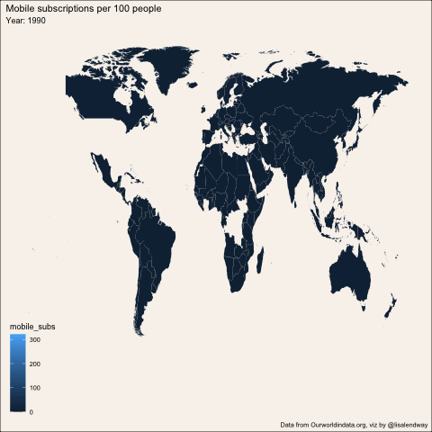

```{r setup, include=FALSE}
# You may want to comment this out at first so you see important messages and warnings
knitr::opts_chunk$set(echo = TRUE, error=TRUE, message=FALSE, warning=FALSE)
```

```{r libraries}
library(tidyverse)     # for graphing and data cleaning
library(lubridate)     # for date manipulation
library(ggthemes)      # for even more plotting themes
library(ggtext)        # for coloring text in labels
library(naniar)        # for exploring missing values
library(gghighlight)   # for highlighting certain values
library(maps)          # for map data
library(ggthemes)      # for themes, including theme_map()
library(gganimate)     # for animation

theme_set(theme_minimal())       # My favorite ggplot() theme :)
```

```{r}
# Read in the data for the week
mobile <- readr::read_csv('https://raw.githubusercontent.com/rfordatascience/tidytuesday/master/data/2020/2020-11-10/mobile.csv')
landline <- readr::read_csv('https://raw.githubusercontent.com/rfordatascience/tidytuesday/master/data/2020/2020-11-10/landline.csv')
```

This week's data is all about phones! 

<center>

{width=200} {width=200}
</center>


Read more about it, including definitions of variables, [here](https://github.com/rfordatascience/tidytuesday/tree/master/data/2020/2020-11-10). 


### Code I worked on during the 30 minute screencast

```{r}
landline %>% 
  add_n_miss() %>% 
  arrange(desc(n_miss_all))
```

```{r}
landline %>% 
  drop_na(landline_subs) %>% 
  group_by(entity) %>% 
  fill(total_pop, gdp_per_cap, .direction = "up") %>% 
  ggplot(aes(x = year, 
             y = landline_subs,
             group = entity,
             color = continent)) +
  geom_line() +
  facet_wrap(vars(continent)) +
  gghighlight(max(landline_subs>100)) +
  theme(legend.position = "none")
```

# animated graph over time

Added some details after 30 minute video.

```{r, eval=FALSE}
world_map <- map_data("world")

landline %>% 
  drop_na(landline_subs) %>% 
  group_by(entity) %>% 
  fill(total_pop, gdp_per_cap, .direction = "up") %>% 
  ggplot() +
  geom_map(map = world_map,
           aes(map_id = entity,
               fill = landline_subs,
               group = year)) +
  #This assures the map looks decently nice:
  expand_limits(x = world_map$long, y = world_map$lat) + 
  theme_map() +
  theme(legend.background = element_blank(),
        plot.background = element_rect("gray70")) +
  transition_states(year) +
  labs(title = "Landlines subscriptions per 100 people",
       subtitle = "Year: {closest_state}",
       caption = "Data from Ourworldindata.org, viz by @lisalendway")
  

anim_save("landline_over_time.gif", path = "images/")
```


In the previous plot, there are missing countries. This code investigates which countries are missing. 

```{r}
world_map %>% 
  distinct(region) %>% 
  anti_join(landline,
            by = c("region"="entity"))
```

# code after 30 minutes

create similar animated map for mobile

```{r, eval=FALSE}
world_map <- map_data("world")

mobile %>% 
  drop_na(mobile_subs) %>% 
  group_by(entity) %>% 
  fill(total_pop, gdp_per_cap, .direction = "up") %>% 
  ggplot() +
  geom_map(map = world_map,
           aes(map_id = entity,
               fill = mobile_subs,
               group = year)) +
  #This assures the map looks decently nice:
  expand_limits(x = world_map$long, y = world_map$lat) + 
  theme_map() +
  theme(legend.background = element_blank(),
        plot.background = element_rect("#F8F3ED")) +
  transition_states(year) +
  labs(title = "Mobile subscriptions per 100 people",
       subtitle = "Year: {closest_state}",
       caption = "Data from Ourworldindata.org, viz by @lisalendway")
  
anim_save("mobile_over_time.gif", path = "images/")
```



Using `geom_polygon()` instead of `geom_map()` - this kept crashing my computer and I don't have time to debug.

```{r, eval=FALSE}
world_map <- map_data("world")

landline %>% 
  drop_na(landline_subs) %>% 
  group_by(entity) %>% 
  fill(total_pop, gdp_per_cap, .direction = "up") %>% 
  inner_join(world_map,
             by = c("entity"="region")) %>% 
 # filter(year == 2010) %>% 
  ggplot() +
  geom_polygon(aes(x = long,
                   y = lat,
                   group = group,
                   fill = landline_subs)) +
  #This assures the map looks decently nice:
  expand_limits(x = world_map$long, 
                y = world_map$lat) + 
  theme_map() +
  theme(legend.background = element_blank(),
        plot.background = element_rect("gray70")) +
  transition_time(year) +
  labs(title = "Landlines subscriptions per 100 people",
       subtitle = "Year: {frame_time}",
       caption = "Data from Ourworldindata.org, viz by @lisalendway")
```
