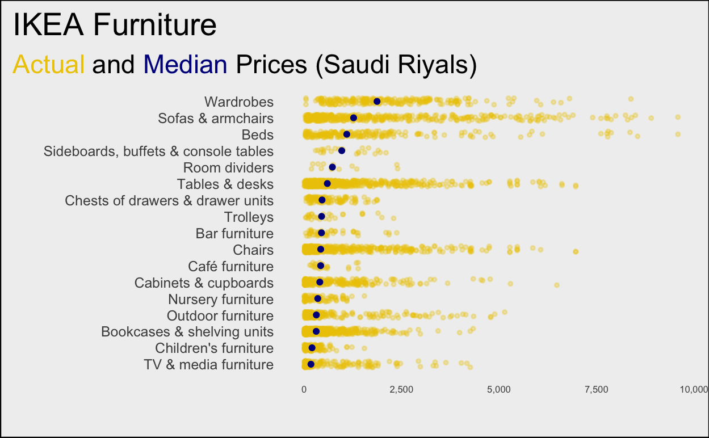
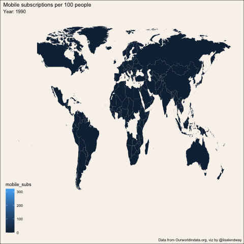
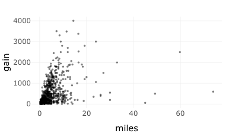
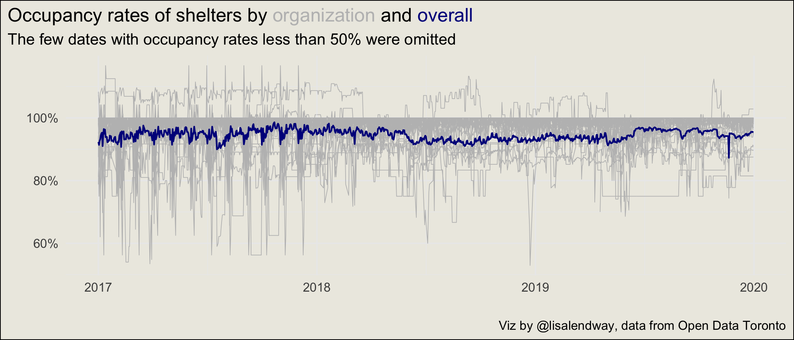

# Tidy Tuesday in Thirty

Repository for .Rmd files where I work with Tidy Tuesday data. I only spend thirty minutes with each file (and maybe a little bit of time after). I record unedited videos of me doing the coding, so they are full of ums and ers but hopefully also good tidbits of R code. You can follow the YouTube [playlist](https://www.youtube.com/playlist?list=PLyEH7o09I464lt0JBNqchKo6dxWD8W8rr), too.

|Date | Topic | File | Video | Final Product | 
| ------ | ------ | ------ | ------ | ------ |
|2020-11-03 | IKEA |  [Rmd](2020_11_03_tidy_tuesday.Rmd) |  [Video](https://youtu.be/iFg89oVJ1xw) |  |
|2020-11-10 | Phones | [Rmd](2020_11_10_tidy_tuesday.Rmd) | [Video](https://youtu.be/fcu4NqDcO4c) |  |
|2020-11-24 | Washington Hiking Trails| [Rmd](2020_11_24_tidy_tuesday.Rmd) | [Video](https://youtu.be/R-QcTB17p28) |  |
| 2020-12-01 | Toronto Shelters | [Rmd](2020_12_01_tidy_tuesday.Rmd) | [Video](https://youtu.be/QwiqEr1Fz3k) | 
